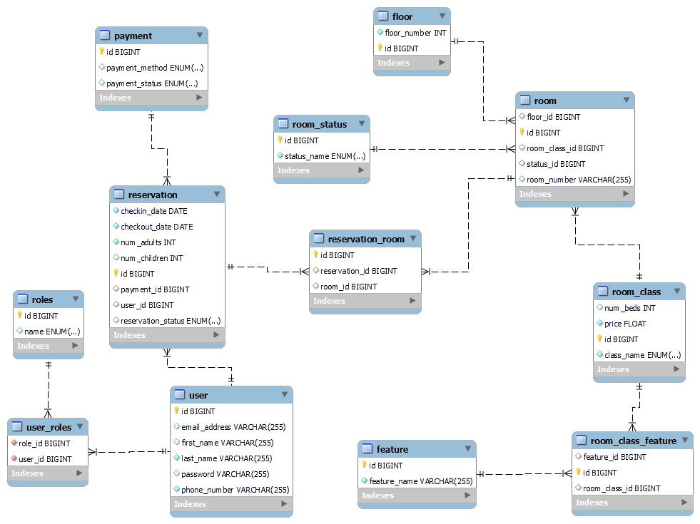

# Hotel Management System

This document represents APIs for hotel management System. These APIs can be used to perform various operations related
to hotel,
such as creating accounts, logging into the system, making reservations, seeing available rooms, paying for
reservations, seeing invoices for a reservation.
In addition to having Role Based operations, where for this basic system, we have two roles, ADMIN, and CUSTOMER, where
a customer is allowed to see his own reservations, make bookings, pay for his reservation etc..
While an admin is allowed, to do all the customer are capable of, in addition to adding new rooms, floors, changing room
classes, and features in addition to changing the costs of these rooms.

## Resource

The following resources are introduced in this system:

- `Feature`: Represents the available features for each room class.
    - `id` : An auto-generated unique identifier for each feature.
    - `featureName` : The name or description of the feature.
- `Floor` :  Represents a specific level or story in a building.
    - `id`: An auto-generated unique identifier for each Floor.
    - `floorNumber` : The numeric identifier of the floor itself.
    - `rooms` : A collection of Room entities associated with this floor. This is mapped as a one-to-many relationship,
      where each Floor can have multiple Room instances.
- `Payment` : Represents a payment made for a reservation.
    - `id` : An auto-generated unique identifier for each Payment.
    - `paymentMethod` : Enumerated type (PaymentMethod) representing the method used for payment.
    - `paymentStatus` : Enumerated type (PaymentStatus) representing the status of the payment
- `Reservation` : Represents a booking made by a user.
    - `id` : An auto-generated unique identifier for each feature.
    - `checkinDate` : Date when the user is scheduled to check into the hotel.
    - `checkoutDate` : Date when the guest is scheduled to check out of the hotel.
    - `numAdults` : Number of adults included in the reservation.
    - `numChildren` : Number of children included in the reservation (optional).
    - `userEntity` : The user who made the reservation.
    - `payment` : Payment associated with the reservation (optional) until checkout date.
    - `reservationStatusEnum` : Enumerated type (ReservationStatusEnum) representing the status of the reservation (
      defaulted to ONHOLD).
    - `reservationRooms` : Collection of ReservationRoom entities associated with a reservation.
- `Role` : Represents a user role in the system can be ADMIN OR CUSTOMER.
- `Room` : Represents a specific room within a building.
    - `id` :An auto-generated unique identifier for each Roo.
    - `floor` : The floor on which the room is on.
    - `roomClass`: The class type of the room
    - `status`: Tghe current status of the room.
    - `roomNumber`: unique identifier or name/number assigned to the room.
    - `RoomClass` : Represents a class or type of room available in the hotel.
        - `className` : Enumerated type representing the name or category of the roo class.
        - `numBeds` : The number of beds available in rooms of this class (optional).
        - `price` : The price per night for rooms of this class of rooms.
- `RoomClassFeature`: Represents a relationship between a room class and a feature associated with that room class.
    - `roomClass` : the room class to to which the feature belongs.
    - `feature` : the feature associated with the room class.
- `RoomStatus` : Represents the status of a room, indicating its current availability or condition.
    - `statusName`: Enumerated type (RoomStatusEnum) representing the name or type of room status.
- `UserEntity` : Represents a user in the system.
    - `emailAddress`: The user email address.
    - `firstName` : The first name of the user.
    - `lastName` : The last name of the user
    - `[phoneNumber` : The phone number of the user.
    - `password` : The encoded password of the user
    - `roles` : The roles assigned to the user.
## ER DIAGRAM
## ER Diagram
<div align="center">
  
</div>
## How to Run the Application

To run the Java Spring Boot application, follow these steps:

1. Make sure you have Java Development Kit (JDK version 21 or higher) installed on your machine.

2. Clone the repository or download the source code for the application.

3. Open a terminal or command prompt and navigate to the root directory of the application.

4. Build the application by running the following command:
    ```
    mvnw clean install
    ```

5. Once the build is successful, start the application by running the following command:
    ```
    mvnw spring-boot:run
    ```
6. The application will start and listen on a specific port (usually 8080). You can access the application by
   opening `http://localhost:8080`.
## HOW TO RUN USING DOCKER  or docker image upload the docker image to docker hub

## Lessons Learned throughout the project
In this project, we learned:
- Importance of role-based access control (RBAC) in application security and how to join it with the JWT token concept and how they both work and complement each others.
- We followed a best practice approach in building restful APIs using spring boot where we followed hateous, and pagination approaches where we learned there importance and how they can help us build better Restful APIs.
- Database design considerations for handling complex relationships between entites and how to handle them in Springboot.
- Creating docker images, and deploying them and how they are used.
- Deployment of applications using Docker containers.
- Collaboration and version control using Git in a team environment.
### Contribution

This project is developed as part of the Web Services class at Birzeit University, taught by Dr. Mohammad Kharmah.
